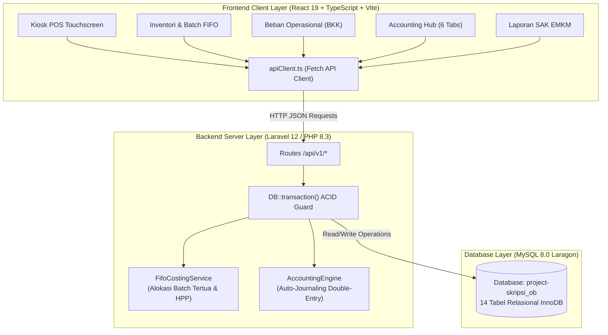

# Spesifikasi Arsitektur Sistem & Landasan Rasionalisasi Pemilihan Teknologi
**Sistem Point of Sale (POS) & Sistem Informasi Akuntansi (SIA) Berbasis Website Berstandar SAK EMKM**  
*Studi Kasus: Toko Ban dan Velg Omah Ban Cabang 3 (OB3)*

---

### Informasi Proyek & Konteks Akademik
- **Judul Skripsi:** *Perancangan Sistem Point of Sale (POS) dan Sistem Informasi Akuntansi Berbasis Website dengan Metode Rapid Application Development pada Toko Ban dan Velg Omah Ban Cabang 3*
- **Peneliti / Pengembang:** Catherine Wong
- **NIM:** 23.G4.0007
- **Program Studi:** Program Studi Akuntansi (Program Ganda: Akuntansi & Sistem Informasi), Fakultas Ekonomi dan Bisnis, Universitas Katolik Soegijapranata Semarang
- **Objek Penelitian:** Toko Ban dan Velg Omah Ban Cabang 3 (OB3) — Magelang, Jawa Tengah
- **Pemilik Usaha (Owner):** Agus Subagyo

---

## 1. Spesifikasi Teknis Sistem (System Specification)

Sistem dibangun menggunakan arsitektur **Decoupled Client-Server (Full-Stack RESTful)** yang memisahkan antarmuka pengguna (*presentation layer*) dari mesin logika bisnis finansial (*business logic & data layer*).

---

### 1.1 Spesifikasi Frontend (Client-Side)

* **Runtime & Framework:** React 19 (`react` ^19.0.1) Single Page Application (SPA).
* **Bahasa Pemrograman:** TypeScript (~5.8.2) dengan mode pengetikan ketat (*strict typing*).
* **Build Tool & Tooling:** Vite 6 (`vite` ^6.2.3), berjalan default di port 3000.
* **Styling & User Interface:** Tailwind CSS v4 (`@tailwindcss/vite` ^4.1.14), Lucide React (`lucide-react` ^0.546.0), dan Framer Motion (`motion` ^12.23.24) untuk animasi antarmuka.
* **Engine Generator Ekspor:**
  * Spreadsheet: `exceljs` (^4.4.0) untuk ekspor `.xlsx` berformat tabel rapi.
  * Dokumen Cetak: `pdfmake` (^0.2.23) untuk pembentukan PDF berstandar A4.
  * Pengolah Kata: `docx` (^9.7.1) untuk pembuatan berkas dokumen `.docx`.
* **Arsitektur Service Layer:**
  * Terisolasi di `src/services/api/`:
    * `apiClient.ts`: Base client Fetch HTTP dengan penanganan otentikasi, format error terstandarisasi, dan konfigurasi header JSON.
    * `posApi.ts`: Endpoint checkout kasir dan riwayat transaksi faktur.
    * `inventoryApi.ts`: Endpoint restock penerimaan ban, mutasi kartu stok, dan opname fisik.
    * `expenseApi.ts`: Endpoint pencatatan Bukti Kas Keluar (BKK) dan audit pembatalan (*VOID*).
    * `accountingApi.ts`: Endpoint jurnal umum, buku besar per akun, neraca saldo, buku pembantu hutang/piutang, dan laporan SAK EMKM.
    * `productApi.ts`: Endpoint katalog produk dan master jasa.
  * *Fallback Client-Side:* `src/services/supabaseDataService.ts` sebagai mekanisme toleransi gangguan (*offline resiliency/data cache*).

---

### 1.2 Spesifikasi Backend (Server-Side)

* **Runtime & Framework:** PHP 8.3+ dengan Laravel 12 (Framework v13/12), berjalan di port 8000.
* **Protokol Komunikasi:** RESTful API dengan output standar `application/json` berawalan `/api/v1/`.
* **Arsitektur Pengontrol & Layanan (*Controllers & Services*):**
  * `App\Http\Controllers\Api\v1`: Berisi controller terisolasi per domain bisnis (`PosController`, `InventoryController`, `ExpenseController`, `AccountingReportController`, `ProductController`, dll.).
  * `App\Services\FifoCostingService.php`: Engine alokasi batch stok tertua (`received_date ASC`), kalkulasi HPP otomatis, dan pencatatan audit trail alokasi per item faktur.
  * `App\Services\AccountingEngine.php`: Engine akuntansi terpusat yang menjalankan prinsip pembukuan berpasangan (*double-entry bookkeeping*), validasi $\sum \text{Debit} = \sum \text{Kredit}$, dan otomatisasi jurnal memorial serta jurnal pembalik (*reversal journal*).
* **Keamanan Transaksi Data:** Seluruh operasi multi-tabel (seperti checkout kasir yang mencakup stok, batch, faktur, dan jurnal) dibungkus dalam blok atomik `DB::transaction()` untuk menjamin kepatuhan ACID.

---

### 1.3 Spesifikasi Basis Data (MySQL 8.0)

* **Engine:** MySQL 8.0 (Laragon) dengan mesin penyimpanan **InnoDB** (*full ACID compliance* dan dukungan *Foreign Key Constraints*).
* **Nama Database:** `project-skripsi_ob`.
* **14 Entitas Model Relasional:**
  1. `products`: Master katalog ban baru, velg, dan ban dalam.
  2. `product_batches`: Lapisan persediaan FIFO (`batch_number`, `initial_quantity`, `current_quantity`, `buy_price`, `received_date`, `status`).
  3. `service_masters`: Master jasa pengerjaan bengkel (Spooring 3D, Balancing, Bongkar Pasang Ban).
  4. `suppliers`: Distributor resmi ban (PT Bridgestone Tire Indonesia, PT Sumi Rubber Indonesia, dll.).
  5. `sales`: Header faktur penjualan kasir (`invoice_number`, `total_amount`, `payment_method`, `cashier_name`).
  6. `sale_details`: Baris rincian item barang/jasa yang terjual.
  7. `sale_batch_allocations`: Rekam jejak audit alokasi batch FIFO per item faktur penjualan.
  8. `sales_bookings`: Pencatatan booking DP dan sisa pelunasan pelanggan.
  9. `stock_movements`: Kartu riwayat mutasi stok masuk, keluar, dan selisih opname.
  10. `expense_categories`: Master kategori beban operasional bengkel terpetakan ke kode COA.
  11. `expenses`: Transaksi pengeluaran kas operasional (`bkk_number`, nominal, status ACTIVE/VOID).
  12. `accounts`: Bagan Akun Standar (COA) SAK EMKM 21 akun.
  13. `journal_entries`: Header jurnal umum (`journal_number`, tanggal transaksi, referensi dokumen).
  14. `journal_items`: Baris ayat jurnal debet dan kredit (`account_id`, `debit`, `credit`).

---

## 2. Landasan Rasionalisasi & Justifikasi Pemilihan Teknologi

Pemilihan kombinasi teknologi di atas didasarkan pada pertimbangan kebutuhan lapangan operasional toko ban serta pemenuhan standar ilmiah akademis:

### 2.1 Mengapa Frontend Menggunakan React 19 + TypeScript + Vite?
1. **Kecepatan & Pengalaman Meja Kasir (Zero Latency SPA):** Kasir toko ban bekerja secara cepat dengan antrian pelanggan di bengkel. Penggunaan SPA berbasis React 19 menjamin navigasi antarmuka, pemilihan ukuran ring ban, input plat nomor, dan perhitungan kembalian terjadi seketika tanpa *page reload* yang memperlambat pelayanan.
2. **Keandalan Perhitungan Finansial (Strict Typing TypeScript):** Masalah umum pada JavaScript vanilla adalah *type coercion* (misal angka nominal `"500000"` diperlakukan sebagai string saat dijumlahkan). TypeScript mencegah bug fatal pada kalkulasi subtotal, diskon bertingkat, PPN 11%, dan verifikasi keseimbangan neraca sebelum data dikirim ke backend.
3. **Efisiensi Pengembangan RAD (Vite HMR):** Kecepatan kompilasi instan dari Vite mendukung siklus iterasi cepat dalam metode *Rapid Application Development* (RAD) saat menguji kebutuhan pengguna kasir secara langsung.

---

### 2.2 Mengapa Backend Menggunakan Laravel 12 (PHP 8.3) REST API?
1. **Jaminan Integritas Transaksi ACID (`DB::transaction()`):** Transaksi checkout kasir melibatkan sekurang-kurangnya 4 proses serentak:
   * Pengurangan saldo stok pada master `products`.
   * Pemotongan kuantitas pada layer `product_batches` tertua.
   * Pencatatan faktur `sales` dan detail `sale_details`.
   * Pembukuan ayat jurnal berpasangan otomatis di `journal_entries` dan `journal_items`.
   Jika terjadi gangguan jaringan atau listrik padam saat proses berlangsung, Laravel membatalkan (*rollback*) seluruh proses sehingga tidak terjadi anomali (misal uang tercatat masuk namun stok fisik tidak berkurang).
2. **Pemisahan Tanggung Jawab (*Separation of Concerns*):** Menempatkan logika komputasi akuntansi dan penentuan HPP di sisi server memastikan perangkat kasir (laptop/tablet kasir) tetap ringan dan aturan bisnis tidak dapat dimanipulasi dari peramban kasir.

---

### 2.3 Mengapa Basis Data Menggunakan MySQL 8.0 InnoDB?
1. **Integritas Relasional Kuat:** Seluruh transaksi akuntansi bersifat relasional terikat. InnoDB mendukung *foreign key constraints* dengan aturan `RESTRICT`/`CASCADE` yang mencegah penghapusan akun atau produk yang telah memiliki riwayat mutasi transaksi.
2. **Kesesuaian Standar Industri UMKM:** MySQL adalah basis data terbukti andal, minim konsumsi sumber daya komputasi, dan kompatibel langsung dengan lingkungan server lokal (Laragon) maupun hosting web terjangkau.

---

### 2.4 Mengapa Menggunakan Metode Penilaian Persediaan FIFO (*First-In, First-Out*)?
1. **Karakteristik Fisik Komoditas Ban:** Ban kendaraan bermotor terbuat dari senyawa karet (*rubber compound*) yang memiliki masa kedaluwarsa fisik berdasarkan kode produksi DOT (*Department of Transportation*). Ban yang diproduksi dan diterima lebih awal harus diprioritaskan terjual lebih dahulu untuk mencegah degradasi kualitas karet di gudang.
2. **Objektivitas Penentuan Harga Pokok Penjualan (HPP):** Distributor ban rutin mengubah daftar harga beli akibat fluktuasi bahan baku dan kurs. Metode FIFO memastikan HPP yang diakui mencerminkan harga riil batch tertua yang dikeluarkan, dan nilai persediaan akhir di Laporan Posisi Keuangan (Neraca) mencerminkan harga pasar terbaru yang objektif.

---

### 2.5 Mengapa Menggunakan Standar Akuntansi Keuangan SAK EMKM & *Auto-Journaling*?
1. **Kepatuhan Terhadap Regulasi IAI untuk UMKM:** SAK EMKM (Standar Akuntansi Keuangan Entitas Mikro, Kecil, dan Menengah) dirumuskan oleh Ikatan Akuntan Indonesia (IAI) dengan asas kesederhanaan namun berintegritas. SAK EMKM mewajibkan entitas menyajikan 3 komponen laporan keuangan:
   * **Laporan Laba Rugi**
   * **Laporan Posisi Keuangan (Neraca)**
   * **Catatan Atas Laporan Keuangan (CALK) / Laporan Arus Kas**
2. **Otomatisasi Tanpa Membebani Kasir (*Zero-Accounting Barrier*):** Karyawan operasional bengkel umumnya tidak memiliki kompetensi akuntansi. Fitur *Auto-Journaling* menyembunyikan kompleksitas akuntansi: kasir hanya fokus menginput penjualan atau biaya operasional, dan sistem secara otomatis membukukan ayat jurnal debit dan kredit berpasangan yang seimbang ($\Delta = 0$).

---

### 2.6 Mengapa Menggunakan Metode Pengembangan Rapid Application Development (RAD)?
1. **Siklus Umpan Balik Cepat dengan Pemilik Usaha (Owner):** Toko ban memiliki dinamika operasional lapangan yang unik (misalnya kebutuhan input plat kendaraan, cetak nota ukuran 80mm, pencatatan beban kalibrasi mesin spooring). RAD memungkinkan prototipe antarmuka dibuat, diujikan langsung ke pemilik toko (Bapak Agus Subagyo), dan disempurnakan dalam hitungan hari.
2. **Kesesuaian Waktu Tugas Akhir:** Model RAD memangkas tahapan dokumentasi kaku menjadi iterasi fungsional langsung (*Requirements Planning $\rightarrow$ User Design $\rightarrow$ Construction $\rightarrow$ Cutover*), sehingga sistem siap diimplementasikan tepat waktu sesuai target kelulusan.

---

## 3. Matriks Keselarasan Capaian Skripsi Ganda

| Dimensi Program Studi | Tantangan Bisnis Omah Ban Cabang 3 | Solusi Teknis / Konseptual yang Diterapkan |
| :--- | :--- | :--- |
| **Sistem Informasi** | Kiosk kasir lemot, data tersebar, rawan salah hitung, proses tidak transparan. | Arsitektur SPA React 19 + TypeScript terintegrasi ke Laravel REST API dengan transaksi atomik ACID dan pelaporan otomatis. |
| **Akuntansi** | Pembukuan manual belum standar, HPP ban fluktuatif tidak terlacak, laporan keuangan sulit tersusun. | Penerapan metode biaya persediaan FIFO real-time dan Bagan Akun Standar (COA) SAK EMKM dengan fitur *Auto-Journaling* debit-kredit seimbang. |
